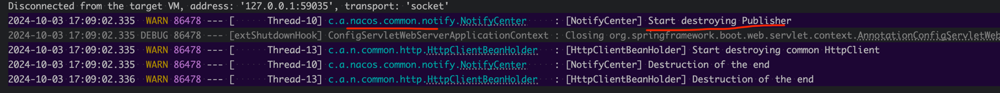
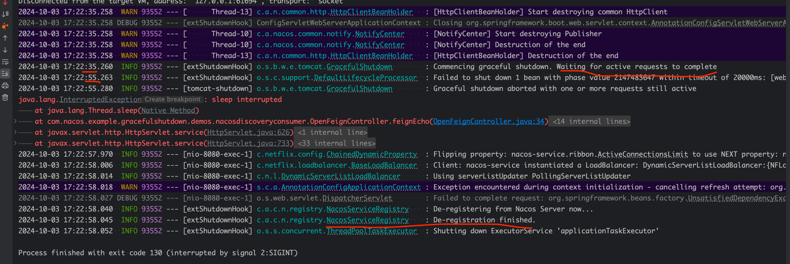

# spring 微服务实现优雅停机demo
要探讨的问题：基于nacos的spring cloud微服务，当服务停止时，如何优雅的停止服务。要做的事情如下：
1. 实例停止时，保证服务不接受新的请求，同时等待已有请求处理完毕后再停止服务。
2. 其他服务在调用该服务时，能够感知到该服务的停止，从而做出相应的处理。

## 1. 服务停止时，立即从注册中心注销
Nacos 目前支持临时实例使用心跳上报方式维持活性，发送心跳的周期默认是 5 秒，Nacos 服务端会在 15 秒没收到心跳后将实例设置为不健康，在 30 秒没收到心跳时将这个临时实例摘除。
基于这个机制，如果不做特殊处理，当服务停止时，会有 30 秒的时间窗口，其他服务还可以调用到该服务。

要想在服务停止时立即从nacos中注销，目前nacos-client是通过jvm的shutdown hook来实现的，当jvm关闭时，会调用shutdown hook，从而注销服务。

`com.alibaba.nacos.common.utils.ThreadUtils.addShutdownHook`
```shell
public static void addShutdownHook(Runnable runnable) {
        Runtime.getRuntime().addShutdownHook(new Thread(runnable));
    }
```
关于shutdown hook的使用，可以参考：https://www.cnblogs.com/crazymakercircle/p/17468001.html#autoid-h3-6-1-0

我们在IDEA中停止服务时，日志如下：


在nacos后台验证结果：当服务停止时，立即从nacos中注销。

## 2. 服务停止时，等待已有请求处理完毕后再停止服务
spring boot2.3开始支持优雅停机，通过`spring.lifecycle.timeout-per-shutdown-phase`配置项来设置优雅停机的超时时间，默认是30s。
https://docs.spring.io/spring-boot/reference/web/graceful-shutdown.html#web.graceful-shutdown

我们在当前项目中添加以下配置：
```shell
spring.lifecycle.timeout-per-shutdown-phase=20s
server.shutdown=graceful
```

同时模拟请求处理时间较长的场景，如下：
```
@GetMapping("/feign/echo/{message}")
    public String feignEcho(@PathVariable String message) {
        // sleep 30s
        try {
            Thread.sleep(30000);
        } catch (InterruptedException e) {
            e.printStackTrace();
        }
        return echoService.echo(message);
    }
```
这时候执行停止实例操作：

等待了20s，才接着执行销毁操作（销毁bean、从nacos server中剔除实例等）

## 3. 其他服务在调用该服务时，能够感知到该服务的停止

我们知道，nacos client会定时从nacos server拉取服务列表，然后缓存到本地（缓存时长假定是30s）。

在服务停止时，nacos server会立即将该实例剔除，但是nacos client缓存的服务列表中还是包含该实例的。

所以，其他服务在调用该服务时，可能会调用到已经停止的服务。

我们可以通过以下方式来解决这个问题：
当我们想停止服务时，分两步：
1. 提前 40s 从 nacos 上剔除，然后再重启对应的项目，保证有 40s 的时间可以用来服务发现刷新实例信息，防止调用方将请求发送到该项目
2. 基于步骤2中的优雅停机，等待已有请求处理完毕后再停止服务


第一步实现逻辑如下：
1. 在项目中定义一个http://localhost:8080/deregister 接口，用于手动剔除服务
```shell
@RestController
public class DiscoveryDeregisterController {
    private static final Logger log = LoggerFactory.getLogger(DiscoveryDeregisterController.class);
    @Autowired
    private NacosAutoServiceRegistration nacosAutoServiceRegistration;

    @RequestMapping("/deregister")
    public String deregister() {
        log.info("deregister from nacos start");
        nacosAutoServiceRegistration.destroy();
        log.info("deregister from nacos success");
        return "ok";
    }
}

```

2. shell脚本实现
参考：

https://blog.csdn.net/zyndev/article/details/131435843
   
https://github.com/alibaba/spring-cloud-alibaba/issues/3665

```shell
function stop()  
{  
    echo "Stop service please waiting...."  
    echo "deregister."  
    curl -X POST "127.0.0.1:${SERVER_PORT}/deregister"  
    echo ""  
    echo "deregister [${PROJECT}] then sleep 40 seconds."  
    # 这里 sleep 40 秒，因为 Nacos 默认的拉取新实例的时间为 30s, 如果调用方不修改的化，这里应该最短为 30s
    # 考虑到已经接收的请求还需要一定的时间进行处理，这里预留 10s, 如果 10s 还没处理完预留的请求，调用方肯定也超时了  
    # 所以这里是 30 + 10 = 40sleep 40  
    kill -s SIGTERM ${PID} 
    if [ $? -eq 0 ];then  
        echo "Stop service done."
    else  
        echo "Stop service  failed!"  
    fi
}
```

当我们想停止一个服务时，执行上述shell脚本，就可以实现优雅停机了。


# 4. 总结
上述方案，需要对我们的服务做修改。
如果我们不想修改服务代码，也可以通过client端的负载均衡重试机制来解决这个问题。
如A请求B，B停止后，A请求B失败，A会重试，这时候A会请求到其他实例。
像ribbon、feign等都有重试机制，可以通过配置来实现。
